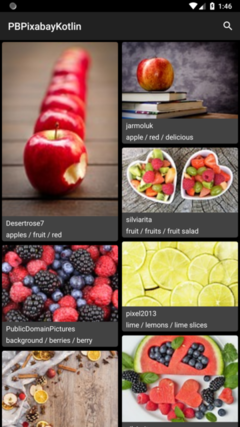
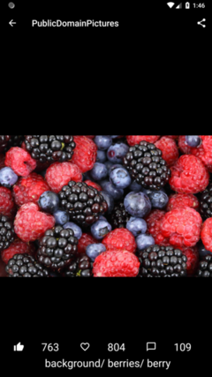
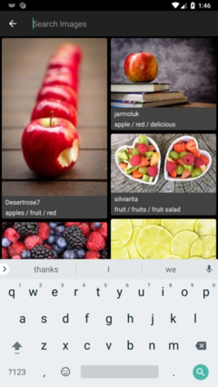

# PBPixabayKotlin

Pixabay for PB

Android Application on Kotlin to show images by using Pixabay Api

List of libraries used in the project

[Data Binding](https://developer.android.com/topic/libraries/data-binding/#java) - The Data Binding Library is a support library that allows you to bind UI components in your layouts to data sources in your app using a declarative format rather than programmatically.

[Retrofit](https://square.github.io/retrofit/) - A type-safe REST client for Android and Java.

[OkHttp](https://github.com/square/okhttp) - An HTTP+HTTP/2 client for Android and Java applications.

[Gson](https://github.com/google/gson) - A Java serialization/deserialization library to convert Java Objects into JSON and back.

[Picasso](https://square.github.io/picasso/) - A powerful image downloading and caching library for Android.

[PhotoView](https://github.com/chrisbanes/PhotoView) - An easily usable implementation of a zooming Android ImageView.

[Timber](https://github.com/JakeWharton/timber) - A logger with a small, extensible API which provides utility on top of Android's normal Log class.

